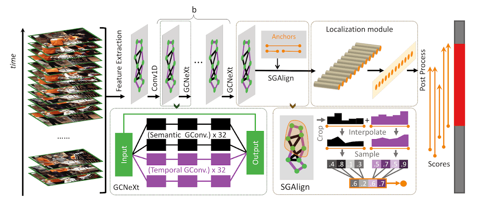

# G-TAD

[](https://paperswithcode.com/sota/temporal-action-localization-on-thumos14?p=g-tad-sub-graph-localization-for-temporal)


This repo holds the codes of paper: "[G-TAD: Sub-Graph Localization for Temporal Action Detection](https://arxiv.org/pdf/1911.11462.pdf)", accepted in CVPR 2020.




## Update
15 Dec 2020: **The configuration for HACS Segment dataset is in the `hacs` branch.** With the [officail I3D pretrained features](http://hacs.csail.mit.edu/challenge.html), G-TAD can reach 27.481 Average mAP without tuning the model architecture. 

24 Nov 2020: to celebrate my 2nd anniversary with Sally, 
I released the code for ActivityNet. :P  Please checkout the branch `anet` to see the details. 
Feature: [GooogleDrive](https://drive.google.com/folderview?id=1ilLgmZYHG1rx0ADuzAkW8jeqdEDeZ19g), md5sum: `0ce54748883c4ce1cf6600f5ad04421b`.


30 Mar 2020: THUMOS14 feature is available!
[GooogleDrive](https://drive.google.com/drive/folders/10PGPMJ9JaTZ18uakPgl58nu7yuKo8M_k?usp=sharing),
[OneDrive](https://kaust-my.sharepoint.com/:f:/g/personal/xum_kaust_edu_sa/EgTwwUGf0O1Kug_A6ym-y_8BlEJ04_xPME9EFbAAKRPQNw?e=AVgHlW)

15 Apr 2020: THUMOS14 code is published! I update the post processing code so the experimental result is **slightly better** than the orignal paper!


29 Apr 2020: We updated our code based on @Phoenix1327's comment. The experimental result is **slightly better**. Please see details in this [issue](https://github.com/Frostinassiky/gtad/issues/4).

## Overview
Temporal action detection is a fundamental yet challenging task in video understanding. Video context is a critical cue to effectively detect actions, but current works mainly focus on temporal context, while neglecting semantic context as well as other important context properties. In this work, we propose a graph convolutional network (GCN) model to adaptively incorporate  multi-level semantic context into video features and cast temporal action detection as a sub-graph localization problem. Specifically, we formulate video snippets as graph nodes, snippet-snippet correlations as edges, and actions associated with context as target sub-graphs. With graph convolution as the basic operation, we design a GCN block called GCNeXt, which learns the features of each node by aggregating its context and dynamically updates the edges in the graph. To localize each sub-graph, we also design a SGAlign layer to embed each sub-graph into the Euclidean space. Extensive experiments show that G-TAD is capable of finding effective video context without extra supervision and achieves state-of-the-art performance on two detection benchmarks. On ActityNet-1.3, we obtain an average mAP of 34.09%; on THUMOS14, we obtain 40.16% in mAP@0.5, beating all the other one-stage methods.

[Detail](https://sites.google.com/kaust.edu.sa/g-tad), [Video](https://www.youtube.com/watch?v=BlPxnDcykUo), [Arxiv](https://arxiv.org/abs/1911.11462).

## Dependencies
* Python == 3.7
* Pytorch==1.1.0 or 1.3.0
* CUDA==10.0.130
* CUDNN==7.5.1_0
* GCC >= 4.9

## Installation
Based on the idea of ROI Alignment from Mask-RCNN, we devoloped **SGAlign layer** in our implementation. You have to compile a short cuda code to run Algorithm 1 in our [paper](https://arxiv.org/abs/1911.11462).

1. Create conda environment
    ```shell script
    conda env create -f env.yml
    source activate gtad
    ```
2. Install `Align1D2.2.0`
    ```shell script
    cd gtad_lib
    python setup.py install
    ```
3. Test `Align1D2.2.0`
    ```shell script
    python align.py
    ```

### Data setup

To reproduce the results in THUMOS14 without further changes:

1. Download the data from [GooogleDrive](https://drive.google.com/drive/folders/10PGPMJ9JaTZ18uakPgl58nu7yuKo8M_k?usp=sharing) or
[OneDrive](https://kaust-my.sharepoint.com/:f:/g/personal/xum_kaust_edu_sa/EgTwwUGf0O1Kug_A6ym-y_8BlEJ04_xPME9EFbAAKRPQNw?e=AVgHlW).

2. Place it into a folder named `TSN_pretrain_avepool_allfrms_hdf5` inside `data/thumos_feature`.


> You could also pass the folder containing the HDF5 files if the script admits the following argument `--feature_path`.

## Code Architecture

    gtad                        # this repo
    ├── data                    # feature and label
    ├── evaluation              # evaluation code from offical API
    ├── gtad_lib                # gtad library
    └── ...

## Train and evaluation
After downloading the dataset and setting up the envirionment, you can start from the following script.

```shell script
python gtad_train.py
python gtad_inference.py
python gtad_postprocessing.py
```
or
```shell script
bash gtad_thumos.sh | tee log.txt
```

If everything goes well, you can get the following result:
```
mAP at tIoU 0.3 is 0.5731204387052588
mAP at tIoU 0.4 is 0.5129888769308306
mAP at tIoU 0.5 is 0.43043083034478025
mAP at tIoU 0.6 is 0.32653130678508374
mAP at tIoU 0.7 is 0.22806267480976325
```

## Bibtex
CVPR Version.
```text
@InProceedings{xu2020gtad,
author = {Xu, Mengmeng and Zhao, Chen and Rojas, David S. and Thabet, Ali and Ghanem, Bernard},
title = {G-TAD: Sub-Graph Localization for Temporal Action Detection},
booktitle = {Proceedings of the IEEE/CVF Conference on Computer Vision and Pattern Recognition (CVPR)},
month = {June},
year = {2020}
}
```

## Reference
Those are very helpful and promising implementations for the temporal action localization task. My implementations borrow ideas from them.

- BSN: Boundary Sensitive Network for Temporal Action Proposal Generation. [Paper](https://arxiv.org/abs/1806.02964) [Code](https://github.com/wzmsltw/BSN-boundary-sensitive-network)

- BMN: BMN: Boundary-Matching Network for Temporal Action Proposal Generation. [Paper](https://arxiv.org/abs/1907.09702) [Code - PaddlePaddle](https://github.com/PaddlePaddle/models/tree/develop/PaddleCV/video/models/bmn) [Code PyTorch](https://github.com/JJBOY/BMN-Boundary-Matching-Network)

- Graph Convolutional Networks for Temporal Action Localization. [Paper](http://openaccess.thecvf.com/content_ICCV_2019/papers/Zeng_Graph_Convolutional_Networks_for_Temporal_Action_Localization_ICCV_2019_paper.pdf) [Code](https://github.com/Alvin-Zeng/PGCN)

## Contact
mengmeng.xu[at]kaust.edu.sa
